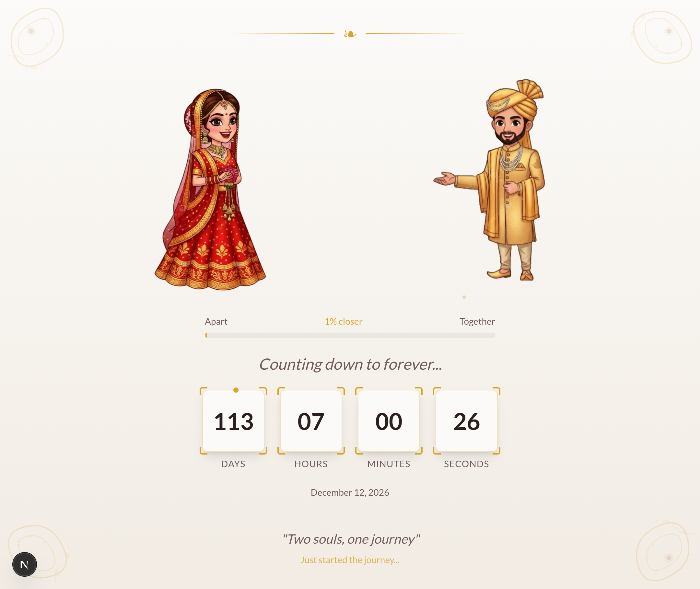

# 💍 Bride & Abdullah's Wedding

> *"Two souls, one journey"* — and one unnecessarily over-engineered website to count down to it.



Welcome to the most romantic Next.js app you'll ever clone. Built with love (and Tailwind) to celebrate the wedding of **Bride and Abdullah** on **December 12, 2026** 🎉

---

## ✨ What's inside

- 💒 **Hero page** with animated bride & groom illustrations that slowly walk *towards each other* as the wedding day approaches. Yes, really.
- ⏳ **Live countdown** ticking down to the big day, second by second
- 📊 **Progress bar** — because "% closer to forever" is a valid metric
- 🌸 **Three event pages** for the full desi wedding experience:
  - **Mehndi** — Dec 11, 2026 @ The Moonlit Garden
  - **Barat** — Dec 12, 2026 @ The Golden Pavilion
  - **Walima** — Dec 13, 2026 @ Enchanted Terrace & Blooms
- 💕 Floating hearts, sparkles, and floral corners — because subtlety is overrated

---

## 🚀 Running it locally

```bash
bun install
bun dev
```

Open [http://localhost:3000](http://localhost:3000) and watch the couple inch closer together.

---

## 🛠 Tech stack

| Thing | Why |
|---|---|
| [Next.js 16](https://nextjs.org) | The framework that shall not be questioned |
| [React 19](https://react.dev) | Fresh off the press |
| [Tailwind CSS 4](https://tailwindcss.com) | Because writing CSS is for the brave |
| [Biome](https://biomejs.dev) | Linting & formatting, the fast way |
| [TypeScript](https://www.typescriptlang.org) | So the bugs have types |
| [Bun](https://bun.sh) | Fast. Very fast. |

---

## 📁 Project structure

```
app/
├── page.tsx          # Main hero with countdown & walking couple
├── mehndi/           # Mehndi event page
├── barat/            # Barat event page
└── walima/           # Walima event page
components/
├── WeddingHero.tsx   # The animated couple magic
├── Countdown.tsx     # Tick tock tick tock
├── EventPage.tsx     # Shared event details layout
└── ...               # Flowers, hearts, and more
constants/
└── index.ts          # The all-important wedding date lives here
```

---

*Made with 💛 for the couple. May your marriage be as bug-free as this code... mostly.*
